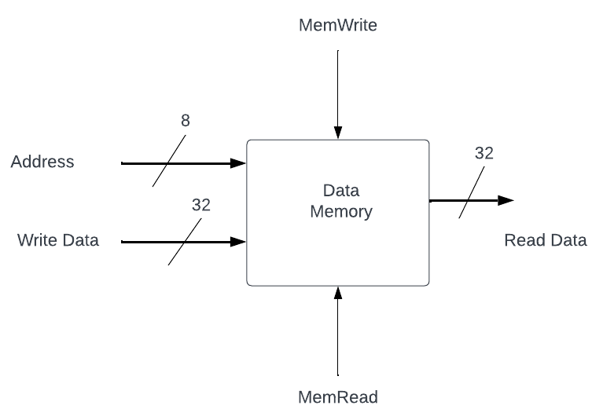

# Lab07 RAM
Similar to the asynchronous ROM that you designed earlier, RAM is a memory block accessed by
supplying an address to the RAM. In the case of RAM though, the data can either be written or read.
This data can be accessed by supplying an address to the RAM; after some time, the RAM will output the 
data stored at that address. Since a RAM can also be written to, the write will happen synchronously, 
when it is known the data is ready to be written. So for this RAM, reads should be asynchronous and 
writes should be synchronous on the rising clock edge.

Remember a memory block, in general, can contain as many addresses in which to 
store data as you desire.  Every address should contain the same amount of data (bits). The number of 
addresses is called the depth of the memory, while the number of bits stored per address is called the 
width of the memory.

Note that the circuit shown below is the same as the data memory in the single-cycle processor, and so
will be of use in a future project.

## Submission
Submit a pdf with the following: 
1) (2 pts) the verilog module for your synchronous RAM
2) (2 pts) the testbench you are using to create a timing diagram
3) (2 pts) schematic for your synchronous RAM
4) (3 pts) a timing diagram for a read, write, read to the RAM, showing the correct output
5) (1 pt) Answer the question at the end of the lab specification.

## A Data Memory Circuit Design



## A Data Memory Verilog Module
Note that a RAM is most easily organized as a two-dimensional net to make indexing easier. 

Syntax: `reg [M:0] <netname> [N:0]`

The above creates a net called `<netname>` and describes it as an array of (N+1) elements, where 
each element is a (M+1) bit number.

Example:
 1) `reg [31:0] ram [255:0];`  // A memory structure that has 256 32-bit elements.
 2) `ram[2]` // The full 3rd 32-bit element
 3) `ram[5][7:0]` // The lowest byte of the 6th 32-bit element

You should use the verilog module definition below to design your RAM. Look at the hints below to remind
you of when to use registers versus wires.

```verilog
module ram (input clk, input [7:0] address, input [31:0] write_data, input memread, input memwrite, output reg [31:0] read_data); 

endmodule
```

## Hints
### Rules for picking a wire or reg net type:
1) If a signal needs to be assigned inside an always block, it must
be declared as a reg.
2) If a signal is assigned using a continuous assignment
statement, it must be declared as a wire.
3) By default module input and output ports are wires; if any
output ports are assigned in an always block, they must be
explicitly declared as reg: output reg <signal name>

### How to know if a net represents a register or a wire.
1) A wire net always represents a combinational link
2) A reg net represents a wire if it is assigned in an always @ (*)
block
3) A reg net represents a register if it is assigned in an always @
(posedge/negedge clock) block

### When should data memory accept write data?
1) First think about when a write happens in terms of the RISC-V architecture. Which type of instruction is being executed every time a write happens?
2) At what time of the cycle would the data to write be ready?

### What should my schematic look like?
1) Your schematic should look as close to the diagram being shown as possible.
2) Consider whether it makes more sense to have a register followed by a multiplexor to account for the default zero addresses or if it makes more sense to have another register.

### Question to turn in
Explain what clock edge you are using to latch the write data into the data memory and why.

Note that in future class meetings we will be looking at exactly when each section of the datapath might
be available and working to understand when their results would be available, but you should have some
insight already for this question based on what you know about circuits at this time.
